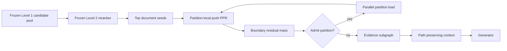

# Level 3: Typed-Edge Graph Diffusion

Level 3 starts from a small set of document seeds and recovers evidence that
semantic or lexical retrieval misses. The current evidence supports PPR as the
robust diffusion engine, with seed quality and graph calibration as the two
important levers.

## Two Implementations

The repository currently contains two Level 3 paths that must not be conflated.

### Integrated runtime

`src/strategies/crag.py` implements the advertised partition-aware runtime:

1. select partitions;
2. rerank documents inside those partitions;
3. run deterministic priority/beam traversal;
4. dynamically admit a neighboring partition;
5. curate a compact generation context.

`src/evaluation/benchmark_level3.py` benchmarks this runtime against a Level
2-only context and synthetic-edge ablations.

### Research diffusion harness

`src/experiments/l3_methods.py`, `l3_solvers.py`, and `l3_srw.py` operate on
direct document seeds and the full document graph. They isolate traversal,
restart-seed, and edge-weight effects, but currently bypass partition routing,
the frozen Level 2 reranker, and generation.

The strong July 2026 results come from this second path.

## What The Experiments Show

### Traversal algorithm

The evaluated methods include dense ranking, one/two-hop expansion, APPNP,
uniform PPR, query-teleport PPR, PPR-cosine reranking, bounded ball search,
bidirectional bridges, coverage-greedy selection, graph-diversity selection,
and rank fusion.

PPR-class methods are the robust default. Query-cosine refinements help on text
corpora such as MuSiQue but fail on MetaQA, where answer entities have weak
cosine similarity to the question. Coverage/diversity penalties also fail on
MetaQA because relevant entities cluster in one relation neighborhood rather
than spreading across graph regions.

### Restart seeds

Relational candidate generation produces much stronger PPR restarts on MetaQA
and MuSiQue. At FullCov@100:

| Dataset | Dense seeds + uniform PPR | Relational seeds + uniform PPR |
| --- | ---: | ---: |
| MetaQA | 43.0 | 55.8 |
| MuSiQue | 54.8 | 73.6 |
| 2Wiki | 62.8 | 60.8 |

The effect is dataset-dependent: relational seeds help when dense retrieval is
weak, but 2Wiki retains stronger dense anchors.

### Typed-edge calibration

`l3_srw.py` distinguishes structural edges from index-time dense-kNN edges and
uses:

```text
weight(u, v) =
    cosine(u, v)^gamma                         structural edge
    beta * cosine(u, v)^gamma                  synthetic edge
```

`beta` and `gamma` are selected on a training subset, then applied to test
queries. Synthetic edges are consistently downweighted, but not universally
removed:

| Dataset/seed source | Selected beta | Selected gamma | Uniform PPR | Reweighted PPR |
| --- | ---: | ---: | ---: | ---: |
| MetaQA/dense | 0.00 | 1.0 | 43.0 | 49.0 |
| MuSiQue/dense | 0.50 | 2.0 | 54.8 | 56.4 |
| 2Wiki/dense | 0.25 | 0.0 | 62.8 | 68.4 |
| MetaQA/relational | 0.00 | 0.0 | 55.8 | 59.4 |
| MuSiQue/relational | 0.25 | 1.0 | 73.6 | 74.2 |

This supports the claim that indiscriminate semantic edges dilute relational
diffusion. It does not support the stronger claim that synthetic edges should
always be deleted.

## Exploratory Best Results

Current FullCov@100 on the first 500 internally split test queries:

| Dataset | Best current configuration | FullCov@100 | FullCov@200 |
| --- | --- | ---: | ---: |
| MetaQA | relational seeds + typed-edge PPR | 59.4 | 72.6 |
| MuSiQue | relational seeds + typed-edge PPR | 74.2 | see result JSON |
| 2Wiki | dense seeds + typed-edge PPR | 68.4 | see result JSON |

Artifacts:

- `data/ukb_storage/{dataset}/results/L3/srw.json`
- `data/ukb_storage/{dataset}/results/L3/srw_champion.json`
- `data/ukb_storage/{dataset}/results/L3/solvers.json`
- `data/ukb_storage/{dataset}/results/L3/solvers_champion.json`
- `data/ukb_storage/_index/l3_srw_*_summary.json`

These are exploratory component results. The solver coefficients and PPR alpha
were iterated while observing the internal test split, and the MLP seed model
was also developed on this split. All choices must be frozen on validation data
before a final official-test run.

## Target Production/Paper Flow



The partition admission score should be based on accumulated residual walk mass,
seed/relation compatibility, and a strict work budget. This is more principled
than opening a partition from one high-scoring boundary node.

The returned object should be an evidence subgraph, not only a flat ranking. It
should retain:

- node score and source retriever;
- parent/path provenance;
- edge type and edge weight;
- partition admission event;
- path-level confidence;
- context token contribution.

## Required Next Work

1. Add the ADD/SWAP multi-head seed model to the Level 3 seed API; current
   “champion” seeding uses the older dense + rel_hard + rel_2hop fusion.
2. Export frozen per-query Level 2 candidates and use the selected reranker as
   the only source of traversal seeds.
3. Replace full-graph dense PPR matrices and full `argsort` with approximate
   push-based PPR over lazily loaded partitions.
4. Learn query-adaptive edge-type weights on train/dev instead of using one
   `beta/gamma` pair per dataset.
5. Preserve structural paths when composing context, especially for MetaQA
   where retrieving answer entities alone does not prove the reasoning chain.
6. Evaluate on untouched official test sets with at least three model seeds.
7. Report Recall/FullCov at 2/5/10/20, support F1, EM/F1, faithfulness, context
   tokens, latency, memory, throughput, and indexing cost.
8. Compare directly with HippoRAG 2, GFM-RAG, HopRAG, KG2RAG, and SiReRAG.

## Naming Guardrails

Use:

> typed-edge calibrated PPR with relational restart seeds

Avoid:

> supervised random walk

until an edge-scoring function is actually learned, and avoid:

> agentic RAG

unless an LLM/controller performs query reformulation, retrieval decisions, or
answer-conditioned stopping.
