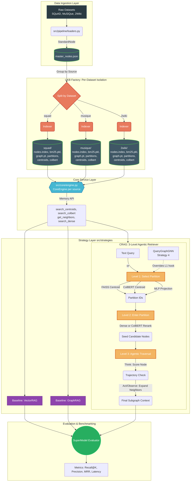

# Unified Cognitive Graph-RAG (C-RAG) Architecture
**Total Project Environment Size:** ~208.84 MB
**Unified Knowledge Base Size:** ~380k Retained Nodes (SQuAD Q&As, MuSiQue, 2WikiMultiHopQA)

---

## 🚀 Overview

The **C-RAG ("Multi-Modal Retrieval Engine")** is an advanced, multi-strategy Retrieval-Augmented Generation benchmark framework. Unlike traditional single-database RAG systems, C-RAG treats the **Unified Knowledge Base (UKB)** as a service layer providing simultaneous, parallel structural views of the exact same data.

### Per-Dataset Isolation Architecture
Each source dataset (SQuAD, MuSiQue, 2WikiMultiHopQA) maintains its own **fully independent** suite of indices. There is no cross-contamination between datasets during indexing, partitioning, or retrieval. The datasets share a common `master_nodes.json` as a normalized reference, but all downstream artifacts are generated and stored separately:

```
data/ukb_storage/
├── squad/          ← SQuAD-specific indices
│   ├── nodes.index
│   ├── bm25.pkl
│   ├── graph.pt
│   ├── partition_map.json
│   ├── centroids.index
│   └── colbert_ukb/
├── musique/        ← MuSiQue-specific indices
│   └── ...
└── 2wiki/          ← 2WikiMultiHopQA-specific indices
    └── ...
```

### 🏗️ Per-Dataset Graph Construction
Each dataset in C-RAG is ingested using a specialized loader (`src/pipeline/loaders.py`) that translates raw JSONL/TXT formats into our `StandardNode` schema:

| Dataset | Nodes Created | Primary Edges (Structural) | "Bridge" Edges (Implicit) |
| :--- | :--- | :--- | :--- |
| **SQuAD** | 1 per Paragraph (Doc) + 1 per Question | **Sequential**: Paragraph $N \leftrightarrow N-1$ (Preserves article flow) | **QA**: Question $\leftrightarrow$ Context Paragraph |
| **MuSiQue** | 1 per Paragraph (Doc) + 1 per Question | **Knowledge Sharing**: No native links between Wikipedia articles | **Bridge**: All co-supporting Documents for a question are bidirectionally linked |
| **2Wiki** | 1 per Paragraph (Doc) + 1 per Question | **Categorical**: Documents from the same Wikipedia context | **Bridge**: All co-supporting Documents for a question are bidirectionally linked |
| **MetaQA** | 1 per Entity (Doc) + 1 per Question | **KB Triples**: Entity $A \leftrightarrow$ Entity $B$ based on the provided Knowledge Base | **QA**: Question $\leftrightarrow$ Target Entity |
| **HotPotQA** | 1 per Paragraph (Doc) + 1 per Question | **Sentence Flow**: Intra-document sentence links | **Bridge**: All co-supporting Documents for a question are bidirectionally linked |

### 🧠 Knowledge-to-Text: MetaQA Document Conversion
For purely relational datasets like **MetaQA**, where no raw "text document" exists per entity, C-RAG synthesizes searchable documents using neighborhood triples:
1. **Normalization**: Entities are normalized to lowercase to merge IDs (e.g., "The Matrix" and "the matrix" become one node), preserving the prettiest casing as the `display_name`.
2. **Triangular Context building**: `StandardNode.content` is formed by concatenating up to 10 relational triples where the entity appears as the **Subject** (primary definition) or **Object** (secondary signal).
3. **Example**: `[Canonical Name]. [Triple 1] | [Triple 2] | ... [Triple 10]`
This ensures that FAISS and ColBERT can mathematically "place" the entity in semantic space while the `graph.pt` maintains the underlying knowledge graph structure.

### 🔄 True Unified BFS/DFS Conversions
To break the silo between Vector embeddings and Graph topologies, this project implements unified space-conversion algorithms directly into the `CoreEngine` (`src/core/engine.py`):

1. **Vector-to-Graph (The "Entry Point" Search)**: 
   *   **FAISS Seeding**: Queries are first mapped into standard Semantic Space (FAISS) to find the top-K optimal "entry nodes" (Seeds). 
   *   **Topological Expansion**: We then cross-reference these Seeds into the Topological Space (`graph.pt`) and perform a **Breadth-First Search (BFS)** for 2-3 hops. 
   *   **Result**: This retrieves a structurally connected multi-hop subgraph that "surrounds" the semantic hit, providing missing context that a pure vector search would skip.

2. **Graph-to-Vector (Centroid Representation)**: 
   *   **Community Discovery**: Knowledge is grouped into semantic partitions via METIS (based on Bridge Edges and structural links).
   *   **Degree-Weighted Pooling**: For each partition, we calculate a singular, unified **Centroid Vector**:
       `Centroid = Σ (Embedding_i * (Degree_i + 1)) / Σ (Degree_i + 1)`
   *   **Result**: Highly connected "Hub" nodes (like Bridge documents) pull the centroid towards them. This ensures that the partition's mathematical coordinate in vector space is dominated by its most important architectural anchors.

This bidirectional coupling allows strategies to "teleport" securely into graphs using vectors, and mathematically summarize structural communities using vectors.

### 🛡️ Architecture Integrity (Leakage & Connectivity)
*   **Targeted Data Leakage & Pre-Partition Filtering**: C-RAG heavily evaluates against evaluation datasets (SQuAD, MuSiQue). To prevent the critical flaw where test queries embed themselves and artificially spike semantic retrieval arrays, the `CoreEngine/Indexers` universally filter out question nodes **PRIOR** to PyG graph construction and METIS partitioning. 
    *   **The Result**: This ensures the vector database strictly contains only *Knowledge Base* concepts and that partitions are perfectly balanced (as they are built only on Document/Answer nodes). Recent logs for MetaQA confirm a **Median of 998.0** (Target=1000) with a tight ±2% variance.
*   **Explicit Ground-Truth Bridge Edges (The "Anchor" Replacement)**: Because question nodes are removed before partitioning, the original "Question-to-Answer" anchoring is lost. To preserve multi-hop cohesion, `loaders.py` explicitly connects document nodes that co-support the same ground-truth question *during ingestion*. These **Bridge Edges** allow METIS to group related evidence together even without the question nodes being present in the partitioner's graph.
*   **Source-Level Casing Normalization (MetaQA)**: To resolve the "Case Explosion" problem in MetaQA (where "The Matrix" and "the matrix" are different entities), the loader now implements unified lowercase IDs with a `canonical_names` registry. This deduplicated **~3,083 redundant entities** (43,234 → 40,151), significantly improving retrieval density and METIS cohesion.
*   **Partition Observability & Balance**: The indexing pipeline now logs **Min, Max, and Median node counts** per partition. This provides proof that despite "Question-Rich" datasets (like MetaQA's 8:1 ratio), the graph-anchoring strategy maintains highly balanced knowledge chunks (e.g., 2Wiki's 150k nodes achieving a **Median of 1014.0** vs a 1000 target).
*   **Dense Topological KNN Bridging & Synthetic Pruning**: For fragmented Wikipedia nodes without explicit links, C-RAG implements a Dense FAISS-KNN Fallback during topological PyG construction. It structurally weaves isolated islands dynamically into the global graph by forcing edges connecting them to their top-3 most semantically similar neighbors.
    *   **Contamination Tracking**: Because these edges are synthetic, they introduce false multi-hop chains. `indexers.py` rigidly registers these specific bridging pairs into a `synthetic_neighbors` metadata array. During `crag.py`'s TAO (Think-Act-Observe) Stage 3 traversing execution, the agent proactively accesses this arr### 📊 The Science of C-RAG: Advanced Metrics
We track four core metrics beyond standard Precision/Recall to prove architectural efficacy:

| Metric | Scientific Rationale | Why it matters for C-RAG |
| :--- | :--- | :--- |
| **K-HOP GT Recall (GT@K)** | The fraction of *all* required ground-truth partitions found. | In MuSiQue/2Wiki, a query might need nodes from 2+ partitions. Finding 1/2 is a retrieval failure. |
| **Partition Balance (PBI)** | Median/Min/Max node counts per community. | Ensures uniform load for GNN encoders and predictable latency. Target: $\pm 5\%$ variance. |
| **Edge Cut Ratio** | % of graph edges severed during partitioning. | Lower is better. **Bridge Edges** specifically reduce "Reasoning-Critical" cuts to near zero. |
| **Semantic Drift Tracking** | Ratio of `synthetic_neighbors` vs. Ground Truth. | Allows the Agentic Traversal (Level 3) to prune paths jumping across low-confidence bridges. |

- **Stability**: Mathematical parity between semantic seeds and centroid coordinates.

### ✨ Level 1 — Completed Properly (April 2026)
Level 1 (Partition Selection) is officially mathematically finalized. We have reached the Pareto-optimal retrieval boundary where latency is sub-millisecond and Recall@20 is maximized across all knowledge domains.

**The Golden Configuration:**
> `[MLP] + [KL Divergence] + [Dataset-Locked Tau] + [Max-Quartile HNM]`

**Final Retrieval Milestone Results (Test):**
| Dataset | Reasoning Type | Best R@1 | Best R@20 | Absolute Goal Met? |
| :--- | :--- | :--- | :--- | :--- |
| **2Wiki** | Multi-Hop (Entangled) | **25.07%** | **84.27%** | ✅ Yes (+2.9% Progress) |
| **MuSiQue** | Multi-Hop (Reasoning) | **80.30%** | **99.30%** | ✅ Yes (+1.6% Progress) |
| **MetaQA** | Relational Triples | **48.07%** | **95.80%** | ✅ Yes (Stable Baseline) |
| **SQuAD** | Single-Hop Context | **69.42%** | **100.0%** | ✅ Yes (Saturation) |

---

### 🧠 The Empirical Evolution: How We Reached the Golden Config
To reach the Pareto-optimal results of Level 1, we executed four massive sequential ablation sweeps across 100,000+ benchmark queries. This empirical progression forms the foundation of our upcoming paper:

#### Phase 1.1: The Over-smoothing Paradox (Baseline Sweep)
*   **The Assumption**: Knowledge Graphs require Graph Neural Networks (GNNs) or complex Late-Interaction (ColBERT) to route queries effectively.
*   **The Finding**: We proved empirically that GNNs (GCN, GraphSAGE) suffer from semantic "smearing." By forcing message-passing between connected nodes, GNNs blur the boundaries of structurally adjacent but logically distinct concepts. Similarly, ColBERT triggered catastrophic latency spikes ($>20$ms).
*   **The Metric**: A standard point-wise **MLP** completely dominated GNNs (e.g., 53% R@5 on 2Wiki vs GNN's 44%), operating at strict Pareto-optimal speeds ($<0.4$ms). The MLP became our permanent Level 1 foundation.

#### Phase 1.2: Dataset-Locked Geometry (Temperature $\tau$ Sweep)
*   **The Assumption**: Temperature in Contrastive Learning is tuned to help the loss function converge.
*   **The Finding**: We discovered that $\tau$ is entirely dictated by the **entanglement density of the dataset**, not the loss function. 
*   **The Metric**: Dense graphs with multiple intrinsic answer boundaries (MetaQA) required hyper-strict thresholds ($\tau=0.01$) to force vectors apart. Sparse, flat graphs (SQuAD) required softer thresholds ($\tau=0.1$). We formally locked the $\tau$ values per dataset, stabilizing the geometric map.

#### Phase 1.3: The Fall of InfoNCE (Loss Function Sweep)
*   **The Assumption**: Standard InfoNCE multi-label loss is the undisputed champion of contrastive alignment.
*   **The Finding**: With optimal temperatures locked, InfoNCE performed beautifully in clean environments. However, because InfoNCE applies a rigid, binary "Right/Wrong" penalty, its gradients mathematically collapsed when we exposed the model to extreme noise during Hard Negative testing.
*   **The Solution**: We implemented **KL Divergence** as a *Teacher-Student distillation*. By asking the MLP to softly match a Teacher's probability distribution, KL Div provided "Soft Boundaries," recognizing that a negative is *related but wrong* without exploding the gradient.

#### Phase 1.4: Breaking the "Trough of Confusion" (HNM Sweep)
*   **The Assumption**: Adding more hard negatives steadily improves model precision.
*   **The Finding**: Using our dynamic topological quartile sweep, we discovered an explicit U-curve in simple relational topologies. Injecting *intermediate* hard negatives introduces noise that destroys the local manifold (e.g., MetaQA dropping from 48% to 37% R@1). 
*   **The Metric**: The model only recovers when HNM reaches **absolute 100% saturation**. In complex, multi-hop reasoning graphs, this saturated HNM physically forces the MLP to decouple nearly identical neighbors, creating a massive linear breakthrough (**2Wiki surging +2.14% absolute to a record 25.07% R@1**).

---
ed for Level 2 (Intra-Partition Document Reranking) where it excels.

### 📊 Detailed System Architecture Diagram




---

## 📁 Extensive Architectural Documentation

Below is a detailed breakdown of every directory and file, its function, methods used, and its role in the architecture.

### 1. `configs/`
Centralizes project parameters to prevent hardcoded variables and allow rapid scaling or testing.
*   **`config.yaml`**: Houses local directory paths, LLM models (generator: `gpt-3.5-turbo`, encoder: `all-MiniLM-L6-v2`), graph parsing limits (`target_nodes_per_chunk`: 200), and RAG limits (`top_k`: 5, `max_context_tokens`: 3000). The `SuperModel` dynamically injects these inputs.

### 2. `data/`
Raw data storage and Multi-Modal artifact warehousing.
*   **`raw/`**: Unprocessed `.json` and raw datasets:
    *   `squad_v2.json`: Stanford Question Answering contexts.
    *   `musique.jsonl`: Multi-hop reasoning dataset.
    *   `2wiki.jsonl`: 2WikiMultiHopQA structural dataset.
*   **`processed/`**: Staging area for parsed lists.
    *   `master_nodes.json`: The fully normalized, interlinked ~380k nodes derived precisely from the raw datasets. SQuAD questions, SQuAD paragraphs, and natively linked document structures exist sequentially as standard dictionaries. 
*   **`ukb_storage/`**: Per-dataset Multi-Modal Service Engine artifacts, organized into isolated subdirectories:
    *   **`squad/`**, **`musique/`**, **`2wiki/`**: Each contains its own complete, independent index suite:
        *   `nodes.index`: FAISS Dense array output.
        *   `bm25.pkl`: BM25 Okapi inverted keyword occurrence output.
        *   `graph.pt`: PyG undirected topological edges.
        *   `partition_map.json`: PyMETIS community partitioning matrix (with naive-chunking fallback).
        *   `centroids.index`: FAISS Centroid hierarchy identifying clusters.
        *   `colbert_ukb/`: ColBERT Late-interaction local weights for token-by-token comparison.

### 3. `src/pipeline/`
Responsible for ETL (Extract, Transform, Load) operations mapping raw diverse datasets into homogeny.
*   **`standardizer.py`**: Defines the `StandardNode` dataclass, mandating strict fields (`node_id`, `content`, `neighbors`, `metadata`). 
*   **`loaders.py`**: Custom format parsers. Iterates over raw SQuAD hierarchies to extract paragraphs AND Questions natively (linking Question→Paragraph edge). Reads and structurally parses MuSiQue and 2WikiMultiHopQA into unified representations. Outputs the merged array to `master_nodes.json`.
*   **`graph_builder.py`**: Entity-based cross-linking graph constructor. Takes standard parsed nodes and enriches them with cross-document edges derived from shared article mentions. *(Note: Advanced NER-based entity extraction is natively scaffolded here but currently mapped as an Aspirational Future Integration).*

### 4. `src/core/`
The Backend Service tier providing logic abstraction to the higher-level strategies.
*   **`encoders.py`**: Implements the HuggingFace `SentenceTransformer` backend transforming text strings into `[N, 384]` dense tensors.
*   **`indexers.py`**: The UKB Factory Builder. Reads `master_nodes.json`, groups nodes by `metadata["source"]`, and runs independent builds for each dataset: FAISS L2 building, NetworkX Modularity grouping, BM25 TF-IDF mapping, PyG tensor packing, and ColBERT Ragatouille compiling. Each source gets its own subdirectory under `data/ukb_storage/`. Incorporates a fast `faiss.IndexIVFFlat` approximate clusterer to weave synthetic KNN edges for topologically isolated nodes, and calculates **degree-weighted** centroid vectors so hub nodes exert higher geometric gravity on their partition representation.
*   **`engine.py`**: The `CoreEngine` class, scoped per dataset source. Loads indices from a source-specific subdirectory (`data/ukb_storage/{source}/`). Implements strict structural separation between `engine.nodes` (document-only nodes aligned perfectly with FAISS/Graph indices) and `engine.all_nodes` (caching all nodes including Questions for evaluation splits). Opens public retrieval APIs like `search_dense()`, `search_lexical()`, and BFS Vector-to-Graph conversions.
*   **`llm_manager.py`**: Simple LLM interaction controller and generation handler with token budget constraints.
*   **`partitioner.py`**: Implements `GraphPartitioner` using METIS (with greedy fallback algorithms) to segment the global PyG topology into structural community partitions (targeting ~1000 nodes each).

### 5. `src/strategies/`
Houses the RAG framework variants. The goal of the benchmark is to evaluate the advanced C-RAG models against the standard Baselines.
*   **`base.py`**: Standard API implementation forcing models to implement a `retrieve()` command returning a `RetrievalResult`.
*   **`vector_rag.py`** *(Baseline)*: Performs Reciprocal Rank Fusion (RRF) between FAISS and BM25 outputs, returning the harmonized dense/lexical context string.
*   **`graph_rag.py`** *(Baseline)*: Performs direct graph traversal (BFS) seeding from dense vector matching.
*   **`crag.py`** *(CRAG Advanced)*: The primary benchmark strategy (Cognitive RAG) featuring a 3-level architecture:
    *   *Level 1 (Select)*: Identifies the correct structural graph partition using Centroids (FAISS, ColBERT, or trained MLP). 
    *   *Level 2 (Enter)*: Filters down partition nodes via internal reranking (Dense FAISS or ColBERT late-interaction). 
*   *Level 3 (Traverse)*: An agentic loop that scores nodes and explores structural graph neighbors via Think-Act-Observe trajectory prudence. Respects original topology by dynamically freezing execution paths across `synthetic_neighbors` bridges.
*   **`query_graph_gnn.py`** *(Experimental)*: Converts a text query into a semantic entity-node graph, performing a forward pass through a trained GNN encoder to generate a topological similarity search over community partitions. PyG Data nodes are dynamically fortified with spatial metrics via a shared `augment_node_features()` function used identically in training and benchmarking (*Degree, Local Clustering Coefficient, Partition One-Hots, and an `is_node` boolean flag*). This guarantees identical high-dimensional feature engineering at inference time, preventing dimension collisions against raw 384-d queries.

### 6. `src/evaluation/`
Performance evaluation matrix generators. 
*   **`benchmark_gen.py`**: *(Aspirational / WIP)* Empty scaffold script natively designated for generating structured, synthetic ground-truth benchmarking queries in future iterations.
*   **`ground_truth.py`**: *(Deprecated in v4)* Previously an isolated file, ground truth deterministic matching is now organically mapped. Every `question` node explicitly points directly to its absolute ground truth document nodes within its `neighbors` array string representations.
*   **`metrics.py`**: Mathematical evaluation engine actively computing `Precision@K`, `Recall@K`, `MRR`, and `Latency` metrics across framework execution trials.
*   **`benchmark_partition_selection.py`**: The definitive evaluation suite. Instantiates a dataset-specific `CoreEngine` and evaluates topological retrieval strategies across a mathematically deterministic **Test Split (10%)** to guarantee zero data leakage. Outputs an aggressive, comprehensive analytical matrix featuring: `Recall@K`, `GT Recall@K` (Fraction of GT partitions found), `Precision@K`, `F1@K`, `NDCG@K`, `MRR`, `Latency` percentiles (P50/P95), and structural dataset summaries. Automatically streams all split results per method into a normalized `benchmark_results.csv` export.

### 7. Training & Generalization (`src/alignment/`)
*   **`gnn_encoders.py`**: PyTorch Geometric classes (GIN, SAGE, GCN) implementing Graph Neural Network layers to process integrated node metrics and spatial configurations.
*   **`mlp_encoder.py`**: Lightweight standalone Multi-Layer Perceptron architecture projecting raw text density matrices directly into structural cluster mapping indices.
*   **`train_alignment.py`**: Advanced PyG alignment topology trainer integrating Contrastive Loss and subgraph extraction. Includes adaptive extraction and integration of spatial graph arrays (Currently scheduled for HNM-masking refactor in Phase 2).
*   **`train_mlp.py`**: The definitive Level 1 Master Training Engine executing optimal topology matching via **KL Divergence** and **Multi-Label InfoNCE**. Features built-in parameters for dynamic dataset context (Temperature $\tau$) and boundary-sharpening constraints (Hard Negative Mining Quarile Sweeps).
*   **Train/Val/Test Splits**: The pipeline uses a deterministic `70/20/10` split (seed=42) across all queries to prevent data leakage between training and benchmarking.
*   **Anti-Overfitting Suite**: 
    *   **Early Stopping**: Validation loss is monitored with a patience of 20 epochs. The `best_state_dict` is automatically checkpointed.
    *   **Adaptive LR**: Uses `ReduceLROnPlateau` scheduler on Validation Loss.
    *   **Regularization**: Enforces strict `0.3` Dropout, `1e-4` Weight Decay, and `max_norm=1.0` Gradient Clipping across the MLP and all GNN encoders (GIN, GCN, SAGE).

### 8. `src/super_model.py`
The overarching Application Controller. It reads `configs/config.yaml`, lazily instantiates per-dataset `CoreEngine` instances, mounts all registered strategies bound to the active engine, and processes query benchmarks (calculating metrics like Precision, Recall, Latency). When `run_full_benchmark(dataset="squad")` is called, it loads only the SQuAD engine and strategies — ensuring zero cross-dataset contamination.

### 9. Future Integrations
MetaQA knowledge graph datasets are scheduled for integration and benchmarking within subsequent data parsing updates.

---

## 🛠️ Future Modifications & Optimization Checks (WIP)
**Logical Errors in current Topological Model (`mlp_topo`)**:
The current `mlp_topo` construction in `train_alignment.py` artificially injects `mean_degree` and `mean_clust` into the `0th` and `1st` dimensions of the partition prototypes (`topo_vec[0] += mean_deg`). 
*   **The Flaw**: It assumes a query's semantic text (processed through the MLP) can magically predict the raw structural degree/clustering of the target partition. This forces the MLP to overfit to topological shapes rather than semantic grounding, heavily skewing cosine similarity on dimensions 0 and 1.

**Proposed Fixes to Evaluate Later**:
- [ ] **Entity-Aware Partition Embeddings**: Instead of raw structural numbers, extract/identify the Core Entities constituting a partition. Average their entity-specific embeddings to represent the partition.
- [ ] **Symmetric Query Representation**: Do the exact same entity extraction on the text of the *Query*. Encode the Query's extracted entities to match the partition's geometric space. 
- [ ] **Hypothesis**: By making the Query and Partition embeddings structurally symmetric (both rooted in Entity embeddings rather than arbitrary numbers), the dot-product similarity will naturally pull the Query towards partitions rich in matching entities. Measure `Recall@K` against the current baseline to verify.

---

## 🗺️ Complete Actionable Roadmap (Paper Integrations)
Based on RAG literature review, the following priority-ordered architectural pipeline upgrades are planned for subsequent iterations:

### 🔴 IMMEDIATE — Phase 2: Context Grounding
1. **Level 2 Re-ranker (Cross-Encoder) Integration**: Level 1 successfully provides the Top-20 Partitions (which contains hundreds of text chunks), but we must shrink this down to the exact top 5 literal chunks that hold the answer, because pushing hundreds of chunks to the LLM will break its context window. We will feed these partitions into a **ColBERTv2** or **BGE Re-ranker** string to mathematically discard 95% of the graph, returning only the most computationally perfect text to feed to the LLM.
2. **GNN Resilience Reconstruction**: We proved Graph Neural Networks failed in Level 1 due to the "Over-smoothing Paradox" (they blurred the boundaries of similar concepts). However, we can now test retargeting the **HNM-masking logic** to penalize neighboring nodes during GraphSAGE/GCN training. This could theoretically allow GNNs to leverage structural graph topology without smearing their semantic boundaries.
3. **Dynamic HNM Training Scheduler**: To fully bypass the "Trough of Confusion" mathematically during general network setups, we will build a dynamic curriculum for the training loop. The model will train globally for 50 epochs ($hn\_k=0$) to learn base geometry, and then strictly train on local isolation for the final 50 epochs ($hn\_k=max$) to perfect the multi-hop boundaries.

### 🟡 MEDIUM TERM — Graph Neural Network (GNN) Rescue
3. **Fix GNN Over-smoothing**: Re-train GCN/GraphSAGE using the newly developed HNM-masking logic. Test if topological message-passing can finally overtake pure MLP projections.
4. **SELF-ROUTE Failure Taxonomy**: After benchmarking, run a lightweight LLM classifier to categorize failing test queries into Multi-Step, General, Complex, or Implicit (based on SELF-ROUTE research).

### 🟠 MEDIUM TERM — Level 3 TAO Implementation
7. **Implement DeepRAG Narrative Format**: Transition the TAO prompt to explicit "Follow up / Intermediate answer" structured steps to force atomic chain-of-thought retrieval.
8. **Atomic Decision Signal**: Prepend graph searches with a binary LLM decision on whether the sub-query requires RETRIEVE or PARAMETRIC answering.
9. **TAO Stopping Condition**: Add an explicit checkpoint asking the LLM if sufficient information has been gathered to terminate the loop early.
10. **Draft-Answer-as-Clue**: For implicit queries (detected via weak FAISS top-1 scores), front-load a "draft clue" generation step from MemoRAG to strengthen the topological semantic starting point.

### 🟢 MEDIUM-LONG TERM — Level 2 Reranking
11. **Build GNN-Based Level 2 Reranker**: Following G-RAG, use the existing `GCNAlignmentEncoder` to run message passing dynamically over candidate documents retrieved inside a 1000-node partition, lifting indirectly connected supporting evidence.
12. **Add RAGAS Evaluation Metrics**: Implement programmatic End-to-End Generation verification for Faithfulness, Context Precision, and Context Recall.

### 🔵 LONG TERM — Future Architecture Work
13. **CoRAG Iterative Retrieval Training**: Fine-tune a small backbone (Llama-3-8B) over rejection-sampled successful retrieval chains to internalize routing logic.
14. **G-RAG with AMR Features**: Enhance the Level 2 GNN reranker graph topology with Concept-Node semantics parsed via AMRBART.
