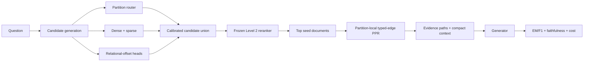

# C-RAG: Coverage-Aware Relational Graph Retrieval

For whole-system comparison against graph-RAG SOTA, use the frozen
[end-to-end reproduction protocol](docs/sota_end_to_end_protocol.md). It keeps
native paper reproduction separate from the matched-corpus table used for CRAG
claims and preserves full ingestion, retrieval, generation, and metric
artifacts under UKB storage.

C-RAG is a research codebase for efficient multi-hop retrieval over text and
knowledge-base graphs. The current work contains two related, but not yet fully
unified, retrieval paths:

1. **Partition pipeline:** learned partition routing, document reranking inside
   selected partitions, and bounded partition-aware graph traversal.
2. **Relational retrieval research stack:** direct document candidate generation
   with dense and learned relational-offset retrievers, followed by
   Personalized PageRank (PPR) on a typed, reweighted graph.

The second path produced the strongest July 2026 retrieval results. It is an
experimental component stack, not yet an end-to-end result for the first path:
the current SRW experiments do not pass through the partition router, frozen
Level 2 reranker, context composer, and answer generator.

## Current Research Status

The code and result JSONs are the source of truth. The project memory under
`C:/Users/Swastik/.claude/projects/C--Users-Swastik-Desktop-CRAG/memory/`
is the experiment ledger; terminal logs and older archived reports are
provenance only.

The reconciled method-by-method provenance audit is in
[`docs/ablation_coverage_audit.md`](docs/ablation_coverage_audit.md). It
separates completed clean studies from test-informed exploratory results,
pre-repartition outputs, leaked artifacts, and implementations that still lack
a compatible result.

### August 2026 update — hybrid retrieval, mechanism audit, standard-corpus rebuild

Three results from the August sweep (full ledger in project memory):

1. **SPLADE (learned lexical) is the single biggest lever, at both levels.** Added
   as an orthogonal axis in a parameter-free best-of fusion over the frozen
   gte-Qwen2 substrate: L1 partition FullCov@20 rises to **96.92**
   (`d+hard+splade`, +1.76); L2 seed-finding to **hit@20 = 97.29 / recall@20 =
   87.34** (`3way+splade`, +4.7). Fixes multi-hop MetaQA where BM25 fails.
   Substrate frozen — only the combination layer changed.

2. **Mechanism audit — partition/overlap-voting does not earn its place as a
   retriever.** At matched budget, dense top-N beats the partition-routed pool by
   30–50 pts recall at tight budgets (`l1_candgen`); the historical "overlap
   helps" FullCov gain decomposes into ~+8 pt metric bucket-inflation minus ~0.6
   pt real dilution (`l1_overlap_test`) — a scoring artifact, net-harmful on every
   text corpus, helping only MetaQA (KB). The rerank (relational head + SPLADE,
   +19 recall, pool-agnostic) is the real contribution.

3. **The graph earns its place at L3 traversal, not L1 routing.** Walking the doc
   graph from dense seeds recovers golds dense cannot reach at any budget
   (`l3_graphlift`): +18 mean union-recall lift (MetaQA +50, 2Wiki +20, HotpotQA
   +11), 78% of dense-missed golds within two hops. Dense finds query-similar
   anchors; the graph reaches the non-similar 2nd hop — complementary, at
   different levels.

**Consequence — architecture and datasets are being realigned** toward a single
dataset-agnostic system (dense candidate-generation → relational+SPLADE rerank →
graph traversal) across three retrieval paradigms: **pure vector, graph-from-text,
and KB**. Datasets are being rebuilt from the all-gold pools to the **standard
official-dev distractor setting** — HippoRAG-comparable 1,000-question candidate
corpora for MuSiQue/2Wiki/HotpotQA, PopQA for pure vector, MetaQA + WebQSP
(subgraph) for KB; scale (fullwiki) deferred until L1/L2/L3 are re-verified on the
corrected corpora. New runners: `l1_candgen`, `l1_overlap_test`, `l3_graphlift`,
`l2_mem_bench`, `splade_encode`; standard-corpus loaders in
`src/pipeline/loader_hipporag.py` and `build_std_masters.py`.

**Standard-corpus rebuild COMPLETE — all results reproduce.** Datasets rebuilt to
the HippoRAG-standard 1,000-question candidate corpora (`musique_hpr_clean` 11,656
docs, `2wiki_hpr_clean` 6,119, `hotpot_hpr_clean` 9,811), plus `squad_std_clean`
(1,204, single-hop control) and MetaQA (KB) — spanning the three retrieval
paradigms (pure-vector / graph-from-text / KB). Every result reproduces:

- **L1 unified dataset-agnostic head:** FullCov@20 mean **98.07** (2wiki 100 /
  hotpot 99 / musique 92 / squad 100 / metaqa 99.35). One head, no per-dataset
  parameters, across all three paradigms.
- **L2 SPLADE hybrid:** hit@20 mean **98.63**, recall@20 91.78.
- **Mechanism verdicts hold:** dense top-N beats the partition pool at tight
  budgets (candgen ΔR@pool3 −4 to −28); graph traversal wins on multi-hop/KB but
  not single-hop (graphlift lift: squad +0.0, text-graph +3..+15, **MetaQA
  +50.7**); overlap "help" is metric bucket-inflation on the relational sets
  (musique +4.8, metaqa +6.6). The paradigm split — pure-vector needs no graph,
  KB depends on it — reproduces cleanly.

Loaders: `src/pipeline/loader_hipporag.py` + `build_hpr_masters.py`. Substrates =
local base (free) + Modal gte/SPLADE encode (~$3 total). Note: local gte-Qwen2
encoding requires a transformers version with `DynamicCache.get_usable_length`;
otherwise run encode/query steps on the GPU backend.

### August 2026 (full-corpus + real-Freebase KB) — proper-scale ablations and WebQSP

The reviewer-facing report reruns every ablation on the **full audited corpora**
(up to 507k docs / 781k KB entities), not the HippoRAG 1,000-question candidate
corpora (those are kept for the head-to-head HippoRAG comparison). At full scale
the picture is sharper and more honest — the summary artifact is
`CRAG_Progress_Report` (Word). Result files under `results/` now carry all six
datasets per ablation.

- **L1 routing: SPLADE is the lever, the relational-offset MLP is not.** One joint
  head over all six datasets: dense mean FullCov@20 = **94.85**; `d+splade|bestof`
  = **96.03** (helps, e.g. 2Wiki 92.7→98.5); `d+hard+mlpT` = **93.84**, *below*
  dense (the MLP's noise hurts the two largest corpora — HotpotQA −3.3, WebQSP
  −6.3). Partition routing is ~neutral vs dense and is not where quality is won.
  This clarifies the small-corpus 98.07 above, which was a near-saturated,
  membership-inflated metric on the 1,000-Q candidate corpora.
- **L2 rerank is where quality is won:** full-corpus Recall@20 lift over dense of
  +2.1 (SQuAD), +9.5 (2Wiki), +11.6 (MuSiQue), **+52.8 (MetaQA)**, +29.8 (WebQSP).
- **L3 traversal is the graph's home:** mean union-recall lift **+25.7** (SQuAD
  +2.0, HotpotQA +11.3, 2Wiki +20.5, MetaQA +50.7, **WebQSP +62.4**).

**WebQSP (real Freebase KGQA) added as the sixth dataset — the KB paradigm done
properly.** 781,485 entities / 2,277,228 triples / 1,628 questions ingested
graph-natively (entities→nodes, triples→edge graph, **all edges kept**; Freebase
mega-hubs — max degree 44,948 — are bounded at traversal time, not by a
build-time degree cap that would orphan leaf entities). It is the sharpest
confirmation of the thesis: answer entities sit at median dense rank **1,184**,
so dense retrieval fails (Recall@20 = 14%) and every graph mechanism inverts to
strongly positive — candidate generation +21.9, overlap +20.6, rerank +29.8,
traversal +62.4. New loader `src/pipeline/loader_webqsp.py`; `ukb-build` sync now
infers the source from the `--nodes` master (`src/experiments/sync.py`).

**Verdict (all six datasets, full corpora):** the graph is essential exactly in
the KB/relational regime and neutral-to-harmful in the text regime. The shippable
pipeline is **SPLADE-routed candidate generation → relational+SPLADE rerank →
graph traversal**, each mechanism earning its place at exactly one level. Full
readout in the report and project-memory ledger.

### Clean substrates

Current July experiments use the label-free clean corpora where available:

| Dataset | Documents/entities | Questions | Partitions |
| --- | ---: | ---: | ---: |
| 2WikiMultiHopQA (`2wiki_clean`) | 65,865 | 15,000 | 658 |
| MuSiQue (`musique_clean`) | 13,672 | 19,938 | 136 |
| HotpotQA (`hotpotqa_clean`) | 66,573 | 6,162 | 665 |
| SQuAD (`squad_clean`) | 19,029 | 130,319 | 190 |
| MetaQA (`metaqa`) | 40,151 entities | 407,513 | 401 |

Question-to-gold links are labels only and are excluded from document graphs.
The clean MuSiQue and 2Wiki loaders do not add co-gold bridge edges. Synthetic
dense-kNN edges are added at index time and tagged separately from structural
title/entity/KB edges.

Important interpretation caveat: MuSiQue, MetaQA, and SQuAD are effectively
all-gold pools in the current local source data. Their relative ablations are
useful, but their absolute recall is optimistic compared with open-corpus RAG.
2Wiki and HotpotQA contain meaningful distractor pools.

### Stage A: candidate generation

The active definition of Level 1 is **candidate generation**, not only
partition routing. Candidate sources include:

- flat dense and cached BM25 retrieval;
- a multi-head, query-conditioned relational-offset retriever;
- top-1 and top-3 dense-seed relational inference;
- learned query-only and query+seed+neighbour partition routers;
- bounded partition quotas (`20x5`, `10x10`, and `5x20`) that each return
  exactly 100 documents rather than materializing whole partitions;
- validation-selected reciprocal-rank fusion of the complementary lists.

The publication-oriented runner is:

```bash
python experiments.py smoke l1-optimize
python experiments.py run l1-optimize --backend modal --account 0 -- \
  --datasets 2wiki_clean --run-id l1opt_v1 --limit 15000 \
  --epochs 40 --heads 1 4 8 --coverage-lambdas 0 0.25 \
  --seeds 42 --hard-negative-k 32 --eval-every 5 --patience 3
```

The preferred headline direction is now one shared checkpoint across all
corpora:

```bash
python experiments.py smoke l1-unified
python experiments.py run l1-unified --backend modal --account 1 -- \
  --datasets 2wiki_clean musique_clean hotpotqa_clean squad_clean metaqa \
  --run-id l1_unified_v1 --limit 15000 --epochs 40 \
  --relational-heads 1 4 8 --coverage-lambdas 0 0.25 \
  --seeds 42 --hard-negative-k 32 --eval-every 5 --patience 3
```

`l1-unified` has no dataset-ID input or dataset-specific learned parameters. It
uses macro-balanced training, a dense skip head, shared relational heads, and
globally validation-selected fusion policies at K=20/50/100 with fixed-budget
centroid routing. Policies vary by budget, never by corpus.
Per-dataset `l1-optimize` runs remain upper bounds. The complete protocol and
acceptance gates are in `docs/level1_unified_protocol.md`.

`l1-optimize` trains with uniform multi-positive KL, optional weakest-positive
coverage and hard-negative margin terms, and early stopping on validation
FullCov@100. It selects the number of heads, coverage weight, partition prior,
and fusion weights on validation only. The test split is evaluated once after
selection, and the selected top-100 document IDs are exported for a frozen
Level 2 comparison. The current `l1opt_v1` runs are screening configurations;
the selected configurations still require a multi-seed confirmation before
they become paper results.

Earlier `l1_headtohead`, `l1_mlp_transformer`, and `l1_mlpt_improve` studies
established that relational offsets and partition routers can improve coverage.
Those runs were iterated against an internal test split and are supporting
exploratory evidence, not the final model-selection protocol. In particular,
the pseudo `rel_2hop` list is not part of the new main method.

The implementation is in:

- `src/experiments/l1_optimize.py`
- `src/experiments/l1_unified.py`
- `src/experiments/l1_headtohead.py`
- `src/experiments/l1_mlp_transformer.py`
- `src/experiments/l1_mlpt_improve.py`

For a paper, call this component a **multi-head relational-offset retriever**,
not a transformer: it is a lightweight mixture of offset heads and has no
self-attention block.

### Stage B: document reranking

The intended Level 2 freezes one Level 1 candidate pool and compares rerankers
on exactly the same candidates:

- BM25;
- dense FAISS;
- SPLADE;
- ColBERT;
- cross-encoder reranking;
- calibrated sparse+dense fusion.

The benchmark body exists in `src/evaluation/level2.py`, but the clean July
candidate-generation stack has not yet been frozen after its multi-seed
confirmation or evaluated through a complete Level 2 sweep. `l1-optimize`
now produces the required per-query candidate file; freezing the winning file
and using it unchanged for every Level 2 method is the remaining connection
between the strongest Stage A and Stage C experiments.

### Stage C: graph diffusion and context retrieval

Eight traversal/reranking variants were compared on matched dense or relational
seeds. PPR-class diffusion was the strongest robust traversal engine; heuristic
bridge, ball, and diversity solvers were dataset-dependent and often failed on
MetaQA, where query-document cosine is weak.

The useful gain came from two levers:

1. **Better restart seeds:** relational candidate generation greatly helps
   MetaQA and MuSiQue, but can hurt 2Wiki.
2. **Better transition graph:** downweighting synthetic kNN edges relative to
   structural edges improves PPR on all three tested datasets.

Exploratory FullCov@100 results:

| Dataset | Dense seed + uniform graph | Best seed/graph stack | Gain |
| --- | ---: | ---: | ---: |
| MetaQA | 43.0 | 59.4 | +16.4 |
| MuSiQue | 54.8 | 74.2 | +19.4 |
| 2Wiki | 62.8 | 68.4 | +5.6 |

These are retrieval-component results over 500 internal test queries, not final
paper numbers. Hyperparameters and method ideas were developed iteratively, so
they must be reselected on validation data and evaluated once on untouched
official test sets. The implementation lives in:

- `src/experiments/l3_solvers.py`
- `src/experiments/l3_srw.py`
- `src/experiments/l3_methods.py`

`l3_srw.py` is best described as **typed-edge calibrated PPR**. It selects two
global transition parameters (`beta`, `gamma`) on a training subset; it is not
yet a learned query-dependent supervised random walk.

## Architecture To Ship



The target Level 3 implementation should preserve the efficiency claim of the
original architecture: run push-based PPR inside selected partitions, admit a
neighbor partition when enough residual walk mass crosses its boundary, and
load admitted partitions in parallel. The current `l3_srw.py` computes
full-graph PPR and full rankings, so it is an oracle-quality retrieval harness,
not the final scalable partitioned runtime.

## Evaluation Protocol Required For Publication

Before using the July gains in a SIGIR/KDD paper:

1. Preserve official train/dev/test boundaries and tune every hyperparameter on
   dev only.
2. Rebuild or adopt benchmark-standard corpora with realistic distractors.
3. Export one frozen per-query candidate pool and use it for all Level 2 and
   Level 3 comparisons.
4. Report Recall/FullCov at tight budgets (2, 5, 10, 20) as well as 50/100/200.
5. Add paired confidence intervals and significance tests over query-level
   outcomes, plus at least three training seeds for learned methods.
6. Compare against current graph and multi-hop systems, including HippoRAG 2,
   GFM-RAG, HopRAG, KG2RAG, and SiReRAG, under matched corpora and readers.
7. Run real answer generation with EM/F1, support/evidence F1, faithfulness,
   context tokens, indexing cost, latency, peak memory, and throughput.
8. Add scale curves and a partitioned-vs-full-graph equivalence/efficiency
   ablation.

## Running Experiments

The unified runner handles local, Modal, and Lightning backends:

```bash
python experiments.py list
python experiments.py smoke l1-optimize
python experiments.py smoke l3-methods
python experiments.py run baselines-rag -- --datasets 2wiki_clean --rerank
python experiments.py run bench-level2 -- --datasets 2wiki
python experiments.py run bench-level3 -- --dataset 2wiki_clean --limit 100
```

Some July research scripts (`l1_headtohead`, `l1_mlpt_improve`, `l3_solvers`,
and `l3_srw`) are not yet registered in `experiments.py`; run them as modules
until they are added to the task registry.

Backend credentials live in the git-ignored
`configs/compute.local.yaml`. Never commit this file.

### UKB reuse and caching

Datasets and indexes are built or downloaded once under
`data/ukb_storage/{dataset}/` and reused by later runs. Level 1 adds:

```text
data/ukb_storage/{dataset}/
  cache/L1/{data_fingerprint}/
    queries_{train,val,test}.npz
    bm25_{val,test}_100.npy
  checkpoints/L1/{run_id}/
    partition_*.pth
    model_*.pth
  results/L1/{run_id}/
    summary.json
    training_history.json
    candidates_test.jsonl
```

The data fingerprint covers query text, split boundaries, gold evidence,
document content and embeddings, partition assignments, and encoder identity.
Training signatures additionally cover the model, loss, HNM, seed, and
optimization settings. Matching caches and checkpoints are loaded without
re-encoding or retraining; changed inputs produce a new fingerprint instead of
silently reusing stale artifacts. Modal and Lightning sync use the same UKB
paths: immutable dataset/index payloads are skipped when present, while cache
and run-specific checkpoint files are checked individually. Completed caches,
checkpoints, results, and candidate exports are pulled back to the local UKB.
Cloud model downloads are also persisted under
`data/ukb_storage/_models/`, so encoder and reranker weights are reused across
containers instead of being downloaded for every run.

## Repository Layout

```text
src/
  alignment/    Partition-router training and coverage losses
  core/         Encoders, indexes, graph access, partition APIs
  evaluation/   Frozen Level 1/2/3 and generation benchmarks
  experiments/  July component studies and unified task bodies
  pipeline/     Clean substrate construction and graph enrichment
  strategies/   Integrated runtime retrievers
data/ukb_storage/{dataset}/results/
                Current structured component results
results/        Cross-run reports and older evaluation outputs
archive/        Superseded, leaked, and pre-clean provenance
```

## Paper Feasibility

The current evidence is strong enough for a serious retrieval paper direction,
but not yet for a full end-to-end C-RAG claim. The most defensible contribution
is a low-cost, coverage-oriented multi-hop retriever showing that relational
seed quality and graph transition calibration matter more than increasingly
complex traversal heuristics. SIGIR is the more natural target. A KDD framing
would additionally require a genuinely learned, query-adaptive transition
model, cross-graph generalization, and substantially larger scalability tests.
